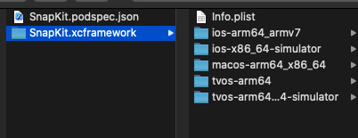

# cocoapods-bb-xcframework

- 你是不是发现 `cocoapods-packager` 不能支持 `Swift`?
- 你是不是发现 `cocoapods-packager` 不能支持 `m1`?
- 你是不是发现 `cocoapods-packager` 不能支持 `GCC module`?
- 你是不是发现 `cocoapods-packager` 不能支持 `watch` 和 `tv`?
- 那你不妨试试我们这个插件～，美滋滋哦～
本插件可以帮助开发者快速的创建一个`OC`/`Swift`的`xcframework`。

## feat
- 支持 `Swift`/`Object-C` 生成 `framework`
- 支持 `Xcode` 新特性: `xcframework`
- 支持 `cocoapods` 绝大多数属性
- 支持 `subspec` 打包
- 支持二进制库是否生成符号表，默认生成，详见`pod xcframework --help`

## Installation

    $ gem install cocoapods-bb-xcframework

## Usage
    $ pod xcframework NAME [SOURCE]
    更多请看
    $pod xcframework --help

```
% pod xcframework --help
Usage:

    $ pod xcframework NAME [SOURCE]

      Package a podspec into a xcframework.

Options:

    --no-force                                                      Overwrite existing
                                                                    files.
    --configuration                                                 Build the
                                                                    specified
                                                                    configuration
                                                                    (e.g. Debug).
                                                                    Defaults to
                                                                    Release
    --spec-sources=private,https://github.com/CocoaPods/Specs.git   The sources to
                                                                    pull dependent
                                                                    pods from
                                                                    (defaults to
                                                                    https://github.com/CocoaPods/Specs.git)
    --subspecs                                                      Only include the
                                                                    given subspecs
    --use-modular-headers                                           pakcage uses
                                                                    modular headers
                                                                    during packaging
    --no-static-library                                             package not use
                                                                    static library
    --enable-bitcode                                                package enable
                                                                    bitcode
    --no-symbols                                                    package not use
                                                                    symbols
    --allow-root                                                    Allows CocoaPods
                                                                    to run as root
    --silent                                                        Show nothing
    --verbose                                                       Show more
                                                                    debugging
                                                                    information
    --no-ansi                                                       Show output
                                                                    without ANSI codes
    --help                                                          Show help banner
                                                                    of specified
                                                                    command
```

## Q&A
### 而且本插件支持`apple`的全平台的`framework`创建,如下图


